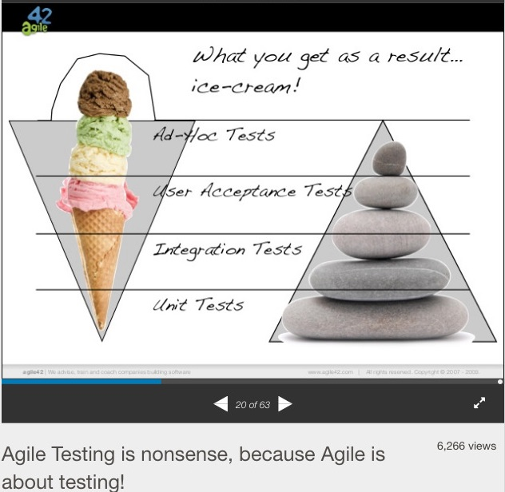
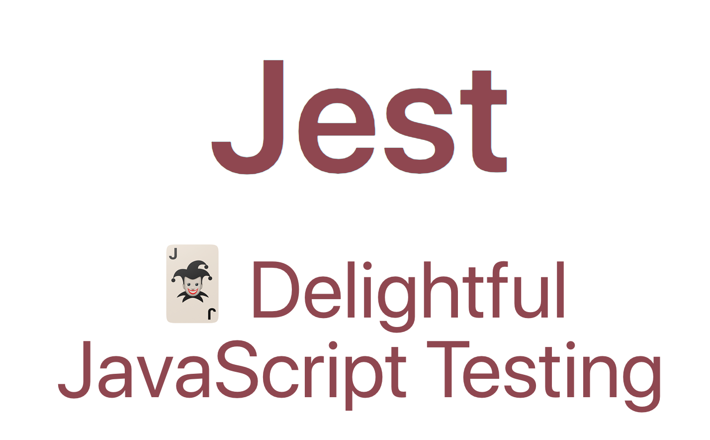
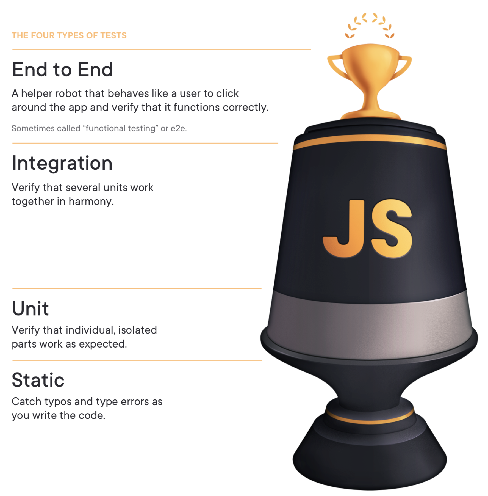
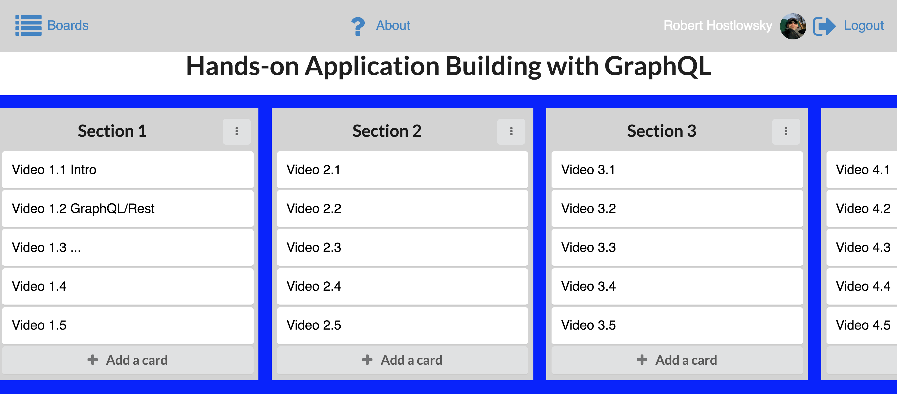

layout: true
<style>.footnote {position: absolute; bottom:0.7em
</style>
<style>.rightFloat {position:absolute; right:0;
</style>
.footnote[Robert Hostlowsky @rhosts | JScraftcamp | July, 2019]
---
class: middle
.center[# Modern Testing in Javascript World
]

<!--
background-image: url(image.jpg)
.footnote[Go directly to [project site](https://github.com/gnab/remark)]     
-->
---
name: agenda
# Agenda
JSCraftcamp | July, 2019 

1. Let's talk about testing
2. Unit testing with Jest  
3. End-to-end testing: a challenge
4. Puppeteer
5. Cypress 

Summary
---
class: center

Robert Hostlowsky

Consultant at codecentric AG, Germany

web-dev-ops-qa-guy

Twitter: @rhosts


---
class: 
.center[
Two sides of the same medal, different *focus*

*Ice-cone of testing*: user / **business values**

*Testing-pyramid*: developer **fast feedback + confidence**

]
---
class: middle    
# Let’s start with Unit tests
---
class: middle
.center[]
---

# Integration Testing

.middle[What if you only have unit tests ...] 

from "painless-react-testing" by [Gled Bahmutov](https://slides.com/bahmutov/painless-react-testing#/1/3)

<video width="800" height="400" controls src="assets/bahmutov-unit_integration.mov" />
---
class: center,middle
# End-to-end Testing
---

## Testing trophy by Kent C. Dodds:
.right[]

---

# Challenge: How can we test this app:


---
<video width="800" height="500" controls src="assets/e2e-challenge.mov" />

---
.center[]
---
class: middle
## https://pptr.dev
> Puppeteer is a Node library which provides a high-level API to control Chrome or Chromium over the DevTools Protocol. 

> Puppeteer runs **headless by default**

```js
const puppeteer = require('puppeteer');

puppeteer.launch().then(async browser => {
  const page = await browser.newPage();
  await page.goto('https://google.com');
  const inputElement = await page.$('input[type=submit]');
  await inputElement.click();
  // ...
});
```
[https://github.com/transitive-bullshit/awesome-puppeteer]

---
class: middle.

* after recording manual steps via puppeteer recorder (chrome extension),
* generated javascript code:

```js
const puppeteer = require('puppeteer');
(async () => {
    const browser = await puppeteer.launch({ 
        devtools: false, slowMo: 0, headless: false 
    })
    const page = await browser.newPage()
    await page.goto('https://www.coolboard.fun/')

    let boards = '.sc-bdVaJa > .ui > .ui > p > a:nth-child(2)';
    await page.waitForSelector(boards)
    await page.click(boards)

    await page.waitForSelector('.App > .sc-bdVaJa > .ui > p > a')
    await page.click('.App > .sc-bdVaJa > .ui > p > a')

    let auth0LockInputEmail = 'div > div > .auth0-lock-input-email > .auth0-lock-input-wrap > .auth0-lock-input';
    await page.waitForSelector(auth0LockInputEmail)
    await page.click(auth0LockInputEmail)

    await page.type(auth0LockInputEmail, Email_Adress)
    let auth0LockInputPassword = 'div > div > .auth0-lock-input-password > .auth0-lock-input-wrap > .auth0-lock-input';
    // ...
```
---
class: middle
### Learnings:

    + easy to start quickly
    + slow-motion mode helps to analyse 
    - hard to maintain, because of "cryptic"_ selectors 
    - one long test plan hard to debug

---
class: inverse
.middle[
]
---

# Cypress - What is it?

A **free**, **open source**, **locally** installed Test Runner + **Dashboard Service** for recording your tests.
  
  Git: 1st commit **Jun 5, 2014**
  
  Public beta: **Oct 9, 2017**
    
 - Test-Runner in an Electron-App
 - Bundled with mocha, jquery, sinon, chai
 - Controlling Chrome Browser via devtools
---
  <video width="800" height="500" controls src="assets/cypress-installing-cli.mp4"></video>
  [cypress, Setting up](https://docs.cypress.io/guides/overview/why-cypress.html#Setting-up-tests)
---
  <video width="800" height="500" controls src="https://docs.cypress.io/img/snippets/writing-tests.0b201bd1.mp4"></video>
  [cypress, Writing tests](https://docs.cypress.io/guides/overview/why-cypress.html#Writing-tests)
---
  <video width="800" height="500" controls src="https://docs.cypress.io/img/snippets/running-tests.4bae660a.mp4"></video>
  [cypress, Running tests](https://docs.cypress.io/guides/overview/why-cypress.html#Running-tests)
---
class: middle

## Many great tutorials, videos, and examples:

https://www.cypress.io/how-it-works/

https://docs.cypress.io/examples/examples/recipes.html

---
class: middle

.center[# Demo
]
---

```js
const gotoBoards = 
    () => cy.get('.sc-bdVaJa > .ui > .ui > p > a:nth-child(2)').click();
function clickLogin() {
    return cy.get('.App > .sc-bdVaJa > .ui > p > a').click();
}
describe('Checkout cypress', function() {
    it('tests coolboard', function() {
        cy.visit('https://www.coolboard.fun/');

        gotoBoards();
        clickLogin();

        cy.get(auth0LockInputEmail).type('MyEmail.com');
        cy.get(auth0LockInputPassword).type(password, { log: false });
        cy.get('#auth0-lock-container-1 > div > div.auth0-lock-center > form > div > div > button > span')
            .click()
            .wait(2000);   // workaround for loading new data from server.
        
        gotoBoards();

        const Create_New_Board_button = '.App > .sc-bdVaJa > .sc-bdVaJa > .ui > .ui';
        cy.get(Create_New_Board_button).click();
        //...

        cy.pause();
```
---
  <video width="800" height="500" controls src="assets/coolboard-cypress-tests.mov"></video>
---
class: middle
# Why soo coool :cool:?
* Integration testing from user perspective
* Fast
* Easy: all stuff built-in
* Network XHR interception/mock/spy
* Parallel testing (easy scaling CI)
---
class: middle
## Comparison to Selenium:
* Faster :runner:
* Autorun/rerun
* All in one place
* More stable, compared to wire protocol
---
class: middle
## Some limits
* Limited to Chrome/Chromium/Electron
* Only javascript/typescript
* No jest support

See cypress page about [trade-offs](https://docs.cypress.io/guides/references/trade-offs.html)
---
class: middle
## Roadmap

* Cross Browser Support (Firefox, IE11) - #310
* 🖥 Screen diffing
* Native events
* 📱 mobile device support

More on [Upcoming-Features](https://docs.cypress.io/guides/references/roadmap.html#Upcoming-Features):

---
## Cypress summary

**More control** and **better insights** than with Jest/Puppeteer:

In the protocol you can additionally see the XHR requests and even all navigation!
That has been a problem with Puppeteer, but was easy to detect!

For even better experience: 
* Have many tests, 
* Test the log-in only once,
* Mock the REST api communication for speed-up

---
class: middle
# Recommendation
Write unit tests with **Jest** 
  
  🎁 Best for Fast Feedback for development / TDD

Have end-to-end tests with **Cypress** 

  🎁 Best for check meeting of the business needs
  
    Cypress for the important (happy path) use cases
  
    Small number of additional *Selenium* tests for some edge cases on other browsers
