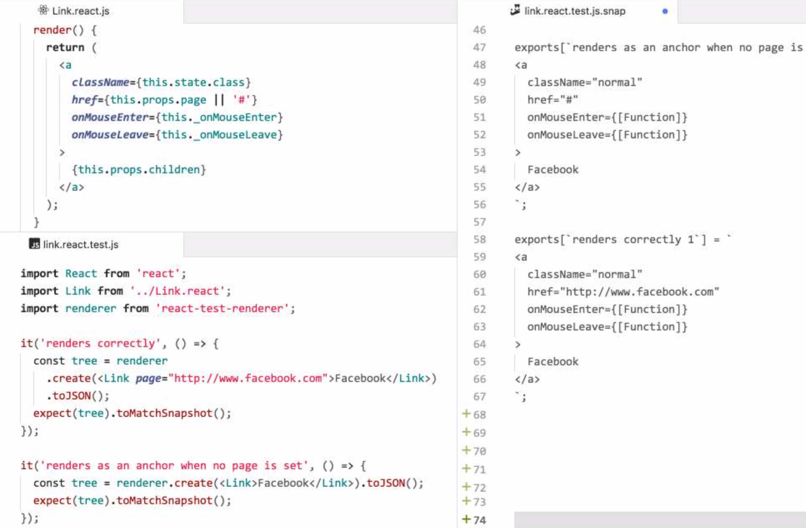
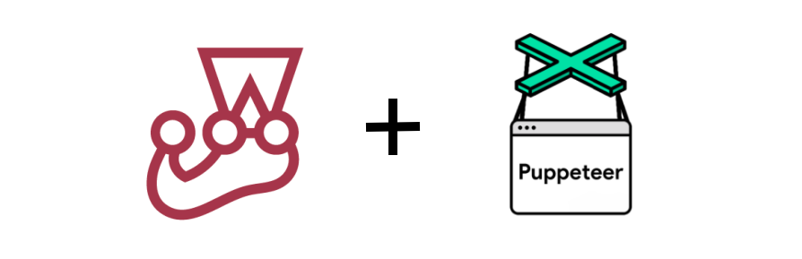

layout: true
<style>.footnote {position: absolute; bottom:0.7em
</style>
<style>.rightFloat {position:absolute; right:0;
</style>
.footnote[Robert Hostlowsky | Modern Testing in JS World | Agile Testing Meetup | 2018]
---
class: middle
.center[# Modern Testing in Javascript World
]

<!--
background-image: url(image.jpg)
.footnote[Go directly to [project site](https://github.com/gnab/remark)]     
-->
---
name: agenda
# Agenda
Agile Testing @Munich - Meetup | Oct. 26, 2018 Munich

1. Let's talk about testing
2. Unit testing with Jest  
3. End-to-end testing: a challenge
4. Puppeteer
5. Cypress 

Summary
---
class: center

Robert Hostlowsky

Consultant at codecentric AG, Germany, since 2020: working at instana

web-dev-ops-qa-guy

Mastodon: https://mastodontech.de/@lowsky


---
class: center
## Andrea Tomasini: 
## "Agile Testing is nonsense, 
--
because Agile is about testing"
    https://www.slideshare.net/tumma72/keynote-agile-testing
    
> "Testing is an attitude which brings us to trust results based on the fact that we can validate them."

---
class: 
.center[
Two sides of the same medal, different *focus*

*Ice-cone of testing*: user / **business values**

*Testing-pyramid*: developer **fast feedback + confidence**

]
---
class: middle    
# Let’s start with Unit tests
---
class: middle
.center[]
---
## Jest: A *modern* Test runner
* Similar to Junit, phpunit, etc.
* Built by facebook

--
* Based on *jasmine*

--
* Runs Tests **in parallel**

--
* All usual [matchers](https://jestjs.io/docs/en/using-matchers) we know from *chai* are already built-in
--

* Extensible: [Expect API](https://jestjs.io/docs/en/expect)
---
# Why Jest?
## Easy setup [Getting started](https://jestjs.io/docs/en/getting-started)
* :battery::battery: All batteries included
* Install via `npm install -g -D jest`
* Basic configuration file via `jest --init`
* ES6 support with `babel-jest`
* Typescript support with `ts-jest`
* Same syntax as *Mocha* and *Chai*: BDD style like *Jasmine*
```js
describe('Test Code with Jest', () => {
        it('should have Test runner
            expect("Jest based on Jasmine").toContain('jasmine');
        });
    });
```
---
class: middle
# Why Jest?

* Great documentation 
* Coverage Report built-in
* CI support with junit-reporter
* Each test has its own virtual environment
* Ide support: atom/webstorm/vscode ...
---
class: middle
# How Jest saves time? :watch:
## watch-mode 🔎
* only changed files, git based !
* module dependencies!

## astonishing clear test/error results

### -> see in demo :tv:
---
class: middle
## asynchronous code ✔
```js
// async/await can be used.
it('works with async/await', async () => {
  expect.assertions(1);
  const data = await user.getUserName(4);
  expect(data).toEqual('Mark');
});
```
or
```js
it('works with promises', () => {
  return user.getUserName(4)
  .then(data => expect(data)
  .toEqual('Mark'));
});
```
https://jestjs.io/docs/en/asynchronous
---
class: middle
## mocking: built-in ✔
[https://jestjs.io/docs/en/mock-functions]
 
---
class: middle
## matchers: built-in ✔
[https://jestjs.io/docs/en/expect]

---
class: center,middle
# :camera: Snapshot testing 
---

---
class: middle
## Use cases for Snapshot testing
* Replacing many asserts/equals 
* UI component comparison
* GraphQL response
* ...
---

# What, if only having unit tests ...?

---

# Integration Testing

(from "painless-react-testing" by [Gleb Bahmutov](https://slides.com/bahmutov/painless-react-testing#/1/3)):
<video width="800" height="400" controls src="assets/bahmutov-unit_integration.mov" />
---
class: center,middle
# End-to-end Testing

Full coverage with **"the Testing trophy"** by Kent C. Dodds:

---

.right[]

---
class: center

# Challenge 🏋️‍♀️
### 🤔 How can we test this app:


---
<video width="800" height="500" controls src="assets/e2e-challenge.mov" />

---
.center[]
---
class: middle
## https://pptr.dev
> Puppeteer is a Node library which provides a high-level API to control Chrome or Chromium over the DevTools Protocol. 

> Puppeteer runs **headless by default**

```js
const puppeteer = require('puppeteer');

puppeteer.launch().then(async browser => {
  const page = await browser.newPage();
  await page.goto('https://google.com');
  const inputElement = await page.$('input[type=submit]');
  await inputElement.click();
  // ...
});
```
[https://github.com/transitive-bullshit/awesome-puppeteer]

---
class: middle,center
## Dream-team: Jest + puppeteer ✨

---
class: middle

###  [jest-puppeteer](https://github.com/smooth-code/jest-puppeteer)

🎁 Extra: Automatically starts a server as part of test suite

``` json
{
  "preset": "jest-puppeteer"
}```

``` js
describe('Google', () => {
  beforeAll(async () => {
    await page.goto('https://google.com')
  })
  it('should display "google" text on page', async () => {
    await expect(page).toMatch('google')
  })
})
```
---

### More extra helpers


``` js
// Assert that a button containing text "Home" will be clicked
await expect(page).toClick('button', { text: 'Home' })
```

``` js
// Assert that current page contains 'Text in the page'
await expect(page).toMatch('Text in the page')
```
``` js
// submit a form
const inputElement = await page.$('input[type=submit]');
await inputElement.click();
```
and more on
https://github.com/smooth-code/jest-puppeteer

---
class: middle.

* after 📹 recording manual steps via **puppeteer recorder** (a chrome extension),
* generated javascript code:

```js
const puppeteer = require('puppeteer');
(async () => {
    const browser = await puppeteer.launch({ 
        devtools: false, slowMo: 0, headless: false 
    })
    const page = await browser.newPage()
    await page.goto('https://www.coolboard.fun/')

    const boards = '.sc-bdVaJa > .ui > .ui > p > a:nth-child(2)';
    await page.waitForSelector(boards)
    await page.click(boards)

    await page.waitForSelector('.App > .sc-bdVaJa > .ui > p > a')
    await page.click('.App > .sc-bdVaJa > .ui > p > a')

    const auth0LockInputEmail = 'div > div > .auth0-lock-input-email > .auth0-lock-input-wrap > .auth0-lock-input';
    await page.waitForSelector(auth0LockInputEmail)
    await page.click(auth0LockInputEmail)

    await page.type(auth0LockInputEmail, Email_Adress)
    let auth0LockInputPassword = 'div > div > .auth0-lock-input-password > .auth0-lock-input-wrap > .auth0-lock-input';
    // ...
```
---
class: middle
### Learnings:

    👍 easy to start quickly
    👍 slow-motion mode helps to analyse

    👎 hard to maintain, because of "cryptic" _ selectors 
    👎 one long test plan hard to debug

---
class: inverse,middle


---

# Cypress - What is it?

A **free**, **open source**, **locally** installed Test Runner + **Dashboard Service** for recording your tests.
  
  Git: 1st commit **Jun 5, 2014**
  
  Public beta: **Oct 9, 2017**
    
 - Test-Runner inside Chrome Browser or Electron-App
 - Bundled with mocha, jquery, sinon, chai
 - Controlling Chrome Browser via devtools
---
  <video width="800" height="500" controls src="assets/cypress-installing-cli.mp4"></video>
  [cypress, Setting up](https://docs.cypress.io/guides/overview/why-cypress.html#Setting-up-tests)
---
  <video width="800" height="500" controls src="https://docs.cypress.io/img/snippets/writing-tests.0b201bd1.mp4"></video>
  [cypress, Writing tests](https://docs.cypress.io/guides/overview/why-cypress.html#Writing-tests)
---
  <video width="800" height="500" controls src="https://docs.cypress.io/img/snippets/running-tests.4bae660a.mp4"></video>
  [cypress, Running tests](https://docs.cypress.io/guides/overview/why-cypress.html#Running-tests)
---
class: middle

## Many great tutorials, videos, and examples:

https://www.cypress.io/how-it-works/

https://docs.cypress.io/examples/examples/recipes.html

---
class: middle

.center[# Demo
]
---

```js
function gotoBoards () { 
  return cy.get('.sc-bdVaJa > .ui > .ui > p > a:nth-child(2)').click() 
}
function clickLogin() {
    return cy.get('.App > .sc-bdVaJa > .ui > p > a').click();
}
describe('Checkout cypress', () => {
    it('tests coolboard', () => {
      cy.visit('https://www.coolboard.fun/');

      gotoBoards();
      clickLogin();

      cy.get(auth0LockInputEmail).type('MyEmail.com');
      cy.get(auth0LockInputPassword).type(password, {log: false});
      cy.get('#auth0-lock-container-1 form  button')
        .click()
        .wait(2000);   // workaround for loading new data from server.

      gotoBoards();

      const New_Board_button = '.App > .sc-bdVaJa .ui';
      cy.get(New_Board_button).click();
      //...
    }
}
```
---
  <video width="800" height="500" controls src="assets/coolboard-cypress-tests.mov"></video>
---
class: middle
# Why soo coool :cool:?
* Integration testing from user perspective
* Fast
* Easy: all stuff built-in
* Network XHR interception/mock/spy
* Parallel testing (easy scaling CI)
---
class: middle
## Comparison to Selenium:
* Faster :runner:
* Autorun/rerun
* All in one place
* More stable, compared to wire protocol
---
class: middle
## Some limits
* Only javascript/typescript
* Limited jest support

See cypress page about [trade-offs](https://docs.cypress.io/guides/references/trade-offs.html)
---
class: middle
## Roadmap

* 🖥 Screen diffing
* Native events
* 📱 mobile device support

More on [Upcoming-Features](https://docs.cypress.io/guides/references/roadmap.html#Upcoming-Features):

---
## Cypress summary

**More control** and **better insights** than with Jest/Puppeteer:

In the protocol you can additionally see the XHR requests and even all navigation!
That has been a problem with Puppeteer, but was easy to detect!

For even better experience: 
* Have many tests, 
* Test the log-in only once,
* Mock the REST api communication for speed-up

---
class: middle
# Recommendation
Write unit tests with **Jest** 
  
  🎁 Best for Fast Feedback for development / TDD

Have end-to-end tests with **Cypress** 

  🎁 Best for check meeting of the business needs
  
    Cypress for the important (happy path) use cases
  
    Small number of additional *UI browser* tests for some edge cases on other browsers
